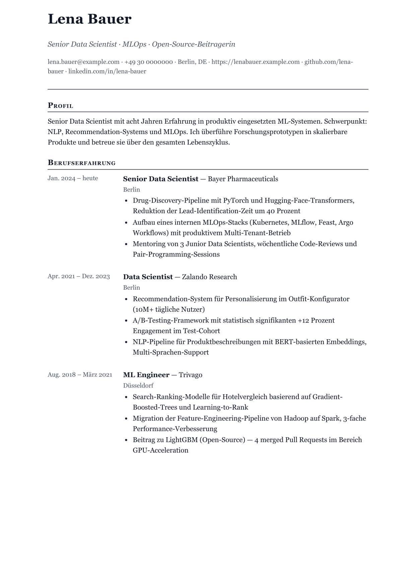
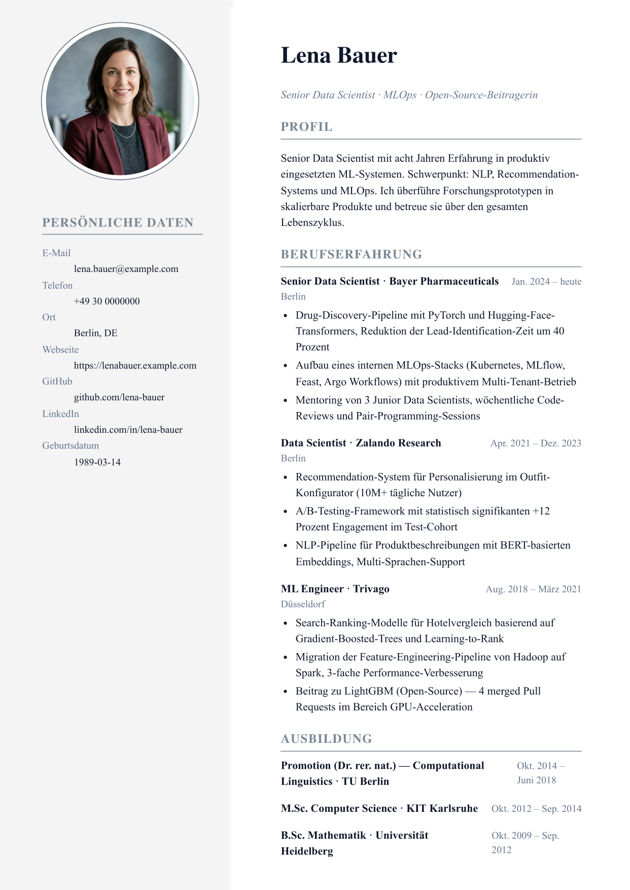
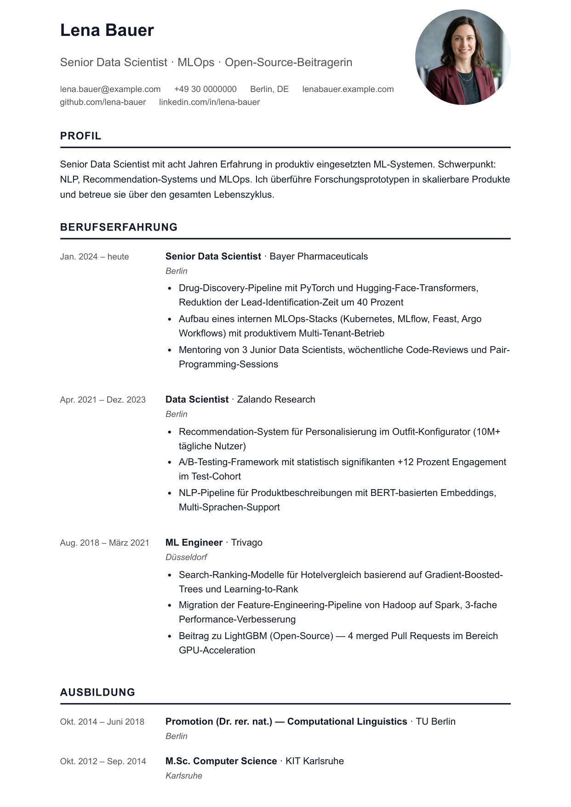
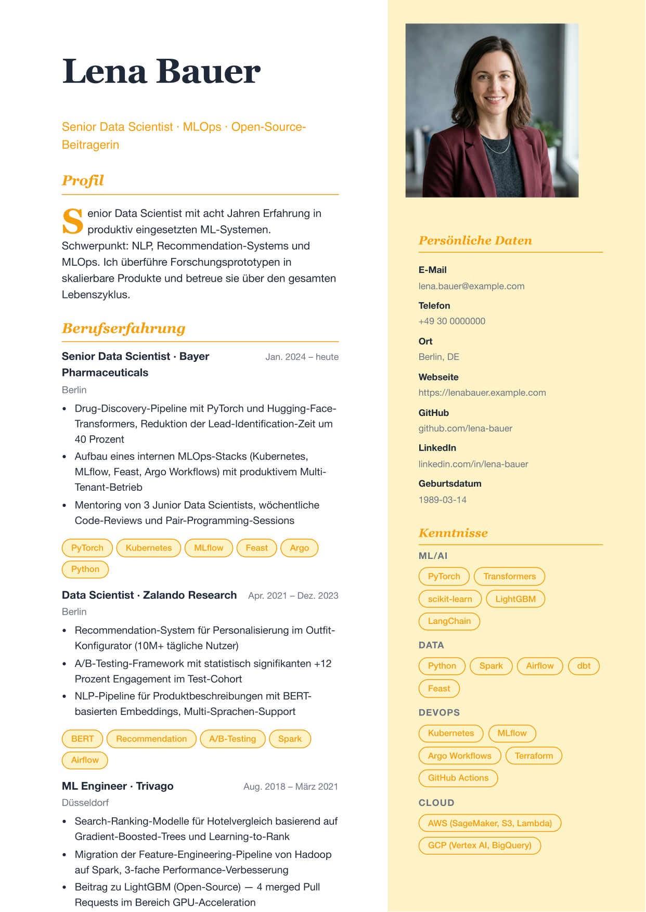
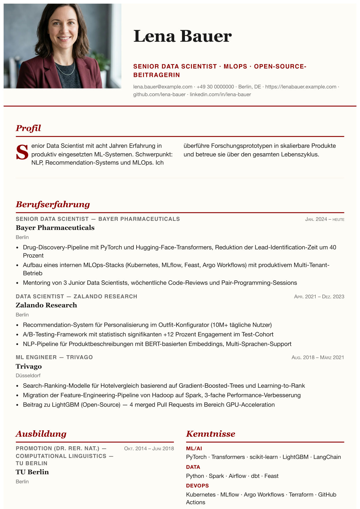
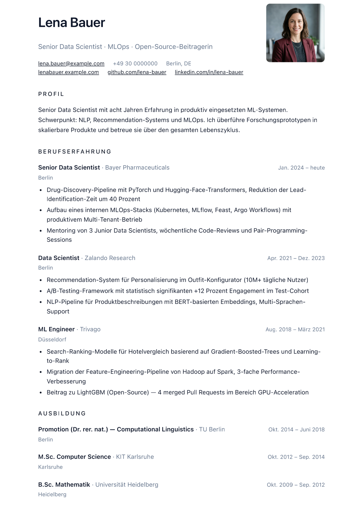
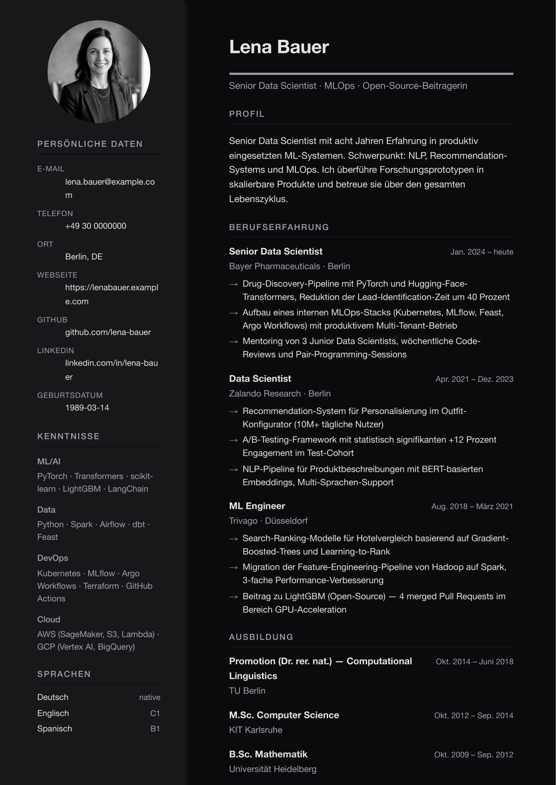
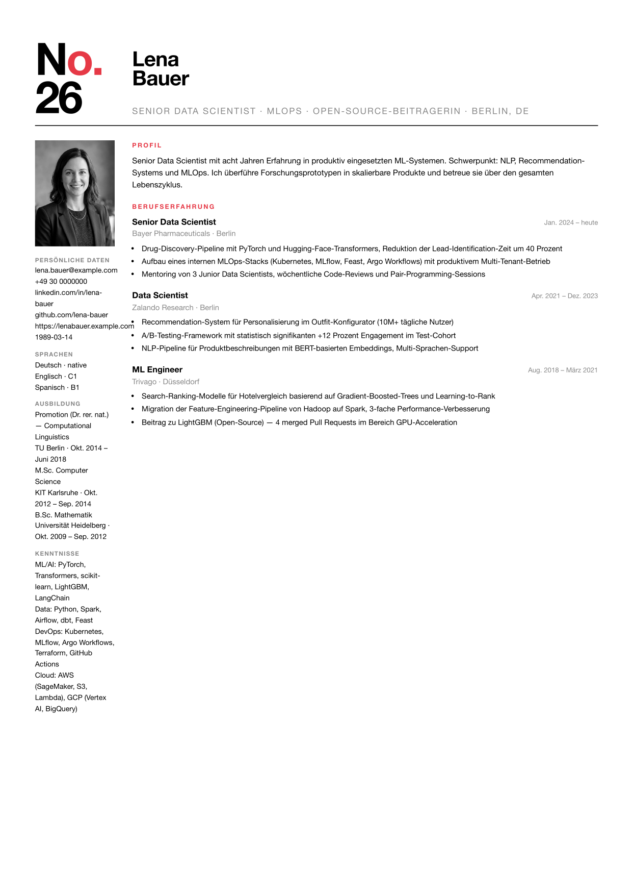
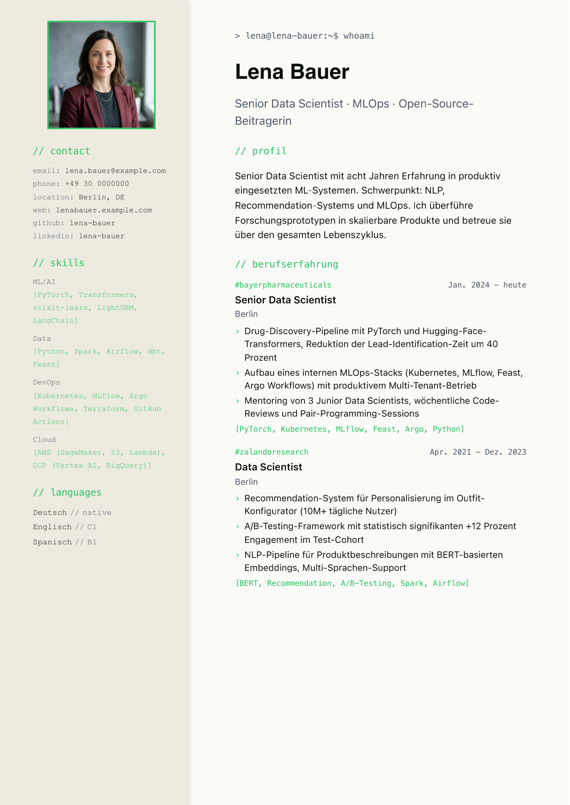

# cvmake

> Open-source CV builder. YAML in, PDF out.

[](https://www.npmjs.com/package/@codevena/cvmake-cli)
[](LICENSE)
[](https://github.com/Codevena/cvmake/actions/workflows/ci.yml)


**→ Live demo: [cvmake.codevena.dev](https://cvmake.codevena.dev)**

---

## Showcase

<table width="100%">
  <tr>
    <td width="25%" align="center"><br/><b>academic</b></td>
    <td width="25%" align="center"><br/><b>bauhaus</b></td>
    <td width="25%" align="center"><br/><b>classic-serif</b></td>
    <td width="25%" align="center"><br/><b>corporate</b></td>
  </tr>
  <tr>
    <td width="25%" align="center"><br/><b>creative-accent</b></td>
    <td width="25%" align="center"><br/><b>editorial</b></td>
    <td width="25%" align="center"><br/><b>magazine</b></td>
    <td width="25%" align="center"><br/><b>modern-minimal</b></td>
  </tr>
  <tr>
    <td width="25%" align="center"><br/><b>monochrome-dark</b></td>
    <td width="25%" align="center"><br/><b>noir</b></td>
    <td width="25%" align="center"><br/><b>swiss</b></td>
    <td width="25%" align="center"><br/><b>tech-dev</b></td>
  </tr>
</table>

## Why cvmake

You have a CV. You want to keep it in version control, render it to multiple templates,
maintain it in two languages, and not pay $9/month forever for the privilege. cvmake does that.

- **One YAML file is the truth** — diff in git, search with grep, copy between machines.
  No Word document mystery formatting.
- **12 polished templates** — academic, bauhaus, classic-serif, corporate, creative-accent,
  editorial, magazine, modern-minimal, monochrome-dark, noir, swiss, tech-dev — each with
  multiple color palettes. Same content, instant restyle.
- **Multilingual by default** — author `cv.de.yaml` + `cv.en.yaml` side-by-side from one
  schema, switch via CLI flag.
- **High-fidelity PDF output** — React + Puppeteer means your live browser preview is
  byte-identical to the exported PDF.
- **CLI or browser** — `npx @codevena/cvmake-cli build cv.yaml` for terminal users,
  [the live editor](https://cvmake.codevena.dev) for everyone else.
- **MIT, no lockin** — your data stays on your machine. Fork the schema, fork a template,
  add your own. The project is small enough to actually read.

## Quickstart

### Install + render in one shot

```bash
npx @codevena/cvmake-cli build path/to/cv.yaml
```

No clone required. The first run downloads Chromium (~150 MB, one-time)
which is needed for high-fidelity PDF rendering.

### Or clone for contribution / customization

```bash
git clone https://github.com/Codevena/cvmake
cd cvmake
pnpm install
pnpm build      # builds the workspace packages once

# Copy the example to your local-only CV (cv.*.yaml is gitignored)
cp data/cvs/example.de.yaml data/cvs/cv.de.yaml

# Render a PDF
pnpm cvmake build data/cvs/cv.de.yaml
```

Output PDF lands in `out/cv.pdf` by default.

## Templates

| ID | Style |
|---|---|
| `academic` | Serif, two-column publication-style layout |
| `bauhaus` | Geometric shapes, primary palette, Futura |
| `classic-serif` | Traditional resume with serif typography |
| `corporate` | Restrained corporate single-column |
| `creative-accent` | Colored accent block, modern sans-serif |
| `editorial` | Magazine-style with strong typography |
| `magazine` | Display serif, italic, two-column body — Vogue-style |
| `modern-minimal` | Minimal, lots of whitespace |
| `monochrome-dark` | Dark theme, high contrast |
| `noir` | Cinematic dark, cream serif, gold accent, prose entries |
| `swiss` | Strict grid, Helvetica, red accent — pure information design |
| `tech-dev` | Developer-focused with code-style accents |

Each template ships with 3+ color palettes. List them all:

```bash
pnpm cvmake list-templates
```

## Tech Stack

- **Monorepo** — pnpm 9 workspaces + Turbo
- **Schema** — Zod
- **Rendering** — React 18 + Puppeteer (headless Chrome → PDF)
- **Web UI** — Next.js 16 (App Router) + Tailwind CSS 4
- **CLI** — Commander 12
- **Testing** — Vitest, Playwright (e2e), visual regression via pixelmatch

## Releasing

(Maintainers only.) All 4 published packages bump in lockstep:

```bash
pnpm -r --filter "@codevena/cvmake-{cli,core,schema,templates}" \
     exec pnpm version <major|minor|patch>
git add -p   # review the version bumps
git commit -m "release: vX.Y.Z"
git tag "v$(node -p "require('./apps/cli/package.json').version")"
git push origin main --tags
```

The tag push triggers `.github/workflows/release.yml` which runs the
full test matrix and publishes all 4 packages via the `NPM_TOKEN`
repo secret. Set the secret once via npm Granular Access Token
(`codevena` org, read+write, long expiration) at
https://github.com/Codevena/cvmake/settings/secrets/actions.

## Contributing

See [CONTRIBUTING.md](CONTRIBUTING.md). Bug reports, template ideas, and pull requests welcome.

See [ROADMAP.md](ROADMAP.md) for what's planned and [CHANGELOG.md](CHANGELOG.md) for what has shipped.

## License

MIT — see [LICENSE](LICENSE).
